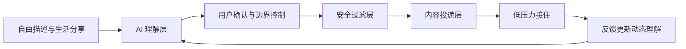

# 同尘 TONGCHEN

> 分享一点生活，被合适的人轻轻接住。  
> Share a little of your life, and let it be gently received.

同尘是一个 AI 驱动的无压力生活分享空间。它不把内容广播给整个公共广场，而是形成一套由用户控制、持续变化的个人理解，将每份生活碎片投递给少量状态与边界相合的人。

**Live Demo:** https://tongchen-light.still-wasp-8803.chatgpt.site

## 我们解决什么问题

年轻人同时面对两种社交困境：公共社交网络充满争论、比较与表演；但在孤独的时刻，一顿饭、一片云或一句话又无人可分享。

传统平台优化“传播”，同尘优化“被合适地接住”。

## 核心逻辑

**理解 → 投递 → 接住**

- **理解：** AI 从用户自由描述中识别兴趣、当下状态、表达方式与社交边界。
- **投递：** 以共同点建立安全感，用适量差异带来新鲜感，把内容交给少量合适的人。
- **接住：** 用“我看见了”“我也有过”和平行分享代替公开评价、热度竞争与回复压力。

## MVP 功能

- 中英文界面切换
- 三步 AI 个性化理解 Demo
- 动态画像的确认、暂停与淡出
- 文字、照片和声音分享入口
- 分享意图与回应边界选择
- 同频、微光、远方三种内容模式
- 共同点与差异可解释匹配
- 低压力“接住”互动
- 越界互动和隐私保护演示
- 桌面及移动端响应式设计

## AI 与安全

AI 是理解与投递的协作者，不是定义人的裁判。所有推断必须可解释、可修改、可暂停并可过期。系统不推断敏感身份，不公开内部画像，也不把脆弱状态用于商业定向。

安全机制包括发布前隐私提醒、陌生账号接近速率限制、私聊双向同意、批量共鸣识别，以及对索取位置、钱财或联系方式等越界行为的阻断。

## 产品架构



AI 理解层由四类信号组成：相对稳定的兴趣与审美、阶段性的生活状态、发布当下的分享意图，以及用户明确设置的互动边界。

## 本地运行

```bash
npm install
cp .env.example .env.local
npm run dev
```

在 `.env.local` 中填写 `OPENAI_API_KEY` 后，发布页的“让 AI 理解这段分享”会通过 OpenAI Responses API 调用 GPT-5.6 Terra，并返回结构化的分享意图、情绪与回应边界。没有密钥时，界面会明确显示为 Demo 理解，不会伪装成真实模型结果。

访问 `http://localhost:3000`。生产构建使用 `npm run build`。

## GPT-5.6 如何参与

同尘把 GPT-5.6 用在最关键、也最需要克制的地方：把一段自然语言分享转换成可由用户确认的结构化理解，而不是替用户下人格结论。服务端 API 路由使用 OpenAI Responses API，默认模型为 `gpt-5.6-terra`；输出只用于帮助投递和尊重回应边界。

- 输入：分享文本与当前界面语言
- 输出：短标题、分享意图、当下情绪、希望获得的回应、可解释摘要
- 控制：结果在发布前可见，用户始终保留最终决定权
- 降级：未配置密钥时使用明确标注的本地 Demo 结果

## Codex 如何加速构建

Codex 贯穿了从产品收束到可提交原型的完整过程：将“求同存异、无压力分享”转化为“理解 → 投递 → 接住”的产品闭环；协助完成安静、安心的交互与响应式实现；建立并逐页审查中英文文案；实现 GPT-5.6 服务端理解链路及透明降级；持续执行生产构建、线上发布检查，并共同整理 Hackathon 文案、演示脚本与提交材料。

Codex 的价值不是一次性生成页面，而是作为持续协作的工程与产品伙伴，让一个抽象的社会洞察在短时间内变成可体验、可解释、可验证的产品。

## Hackathon 交付物

- [提交说明](docs/hackathon-submission.md)
- [2分30秒 Demo 脚本](docs/demo-script.md)
- `outputs/tongchen-hackathon-pitch.pptx` Pitch Deck

## 下一阶段

- 使用真实用户样本评估 GPT-5.6 结构化理解准确率
- 完善多语言内容翻译与发布者授权
- 引入匿名化反馈数据验证“被合适接住率”
- 扩展可解释推荐与信任风控
- 开展小规模封闭用户研究

## 技术栈

React 19、TypeScript、vinext、Vite、OpenAI Responses API、GPT-5.6 Terra、Cloudflare-compatible Sites deployment。
